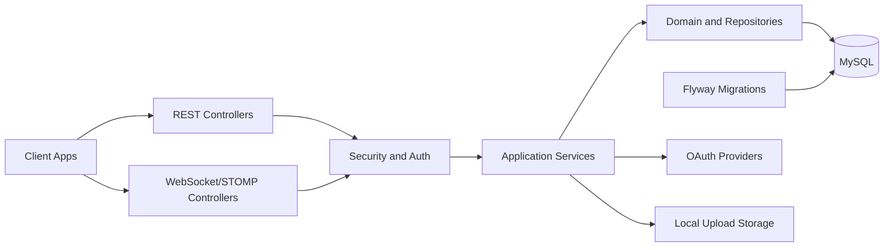

# Blog Backend

학습용을 넘어 실제 서비스 개발 흐름(인증, CRUD, 실시간, 마이그레이션, 테스트)을 모두 담은 Spring Boot 백엔드 프로젝트입니다.

- 게시글/댓글/첨부파일
- 게시글 좋아요 + 댓글 좋아요/싫어요
- 마이페이지 요약/프로필/내 활동 조회
- 공개 블로그 프로필 조회(`/api/blogs/{username}`)
- 채팅방/메시지/읽음/나가기 + 미읽음 실시간 동기화
- 알림 실시간 전파
- JWT 인증
- OAuth2 소셜 로그인(Google/Kakao/Naver)
- 휴대폰/이메일 인증 기반 회원가입 및 계정복구

## Tech Stack

| 구분 | 기술 |
|---|---|
| Language | Java 17 |
| Framework | Spring Boot 3.5 |
| Build | Gradle |
| DB | MySQL 8 |
| ORM | Spring Data JPA (Hibernate) |
| Migration | Flyway |
| Realtime | WebSocket + STOMP |
| API Docs | springdoc-openapi |

## 아키텍처



- `REST Controllers`가 인증, 게시글, 댓글, 마이페이지, 공개 블로그, 신고/추천 API를 처리합니다.
- `WebSocket/STOMP Controllers`가 채팅 메시지, ACK, 미읽음 수, 알림 실시간 전파를 처리합니다.
- `Security and Auth`가 JWT 인증, OAuth2 로그인, 인증번호 검증, 계정 복구 흐름을 담당합니다.
- `Application Services`가 게시글 작성/수정, 채팅방 관리, 블로그 설정, 신고 처리 같은 도메인 로직을 조합합니다.
- `Domain and Repositories`는 JPA 엔티티와 조회/저장 계층이며 최종적으로 `MySQL`에 접근합니다.
- `Flyway Migrations`는 스키마 변경 이력을 관리하고, 업로드 파일은 로컬 저장소 경로와 메타데이터로 분리 관리합니다.

## 시작하기

### 1. 저장소 클론

```bash
git clone https://github.com/example/blog.git
cd blog
```

### 2. 실행 전 요구사항

- Java 17+
- MySQL 8+

### 3. MySQL DB 준비

```sql
CREATE DATABASE blog CHARACTER SET utf8mb4 COLLATE utf8mb4_unicode_ci;
```

필요하면 사용자도 생성하세요.

```sql
CREATE USER 'blog'@'%' IDENTIFIED BY 'change-me';
GRANT ALL PRIVILEGES ON blog.* TO 'blog'@'%';
FLUSH PRIVILEGES;
```

### 4. 환경변수 설정

```bash
cp .env.example .env
```

`.env` 주요 항목:

- `DB_URL`, `DB_USERNAME`, `DB_PASSWORD`
- `JWT_SECRET`, `JWT_EXPIRATION_MS`
- `APP_CORS_ALLOWED_ORIGINS`
- `APP_AUTH_ALLOW_DEV_FALLBACK`, `APP_AUTH_DEV_USER_ID`
- `APP_ADMIN_SEED_ENABLED`, `APP_ADMIN_USERNAME`, `APP_ADMIN_PASSWORD`, `APP_ADMIN_NAME`
- `APP_ADMIN_MUST_CHANGE_PASSWORD`
- `APP_CATEGORY_SEED_ENABLED`, `APP_CATEGORY_SEED_OVERWRITE_EXISTING`
- `APP_BLOG_SEED_ENABLED`, `APP_BLOG_SEED_OVERWRITE_EXISTING`
- `APP_BLOG_SEED_AUTHOR_USERNAME`, `APP_BLOG_SEED_AUTHOR_PASSWORD`
- `APP_OAUTH2_GOOGLE_CLIENT_ID`, `APP_OAUTH2_GOOGLE_CLIENT_SECRET`
- `APP_OAUTH2_KAKAO_CLIENT_ID`, `APP_OAUTH2_KAKAO_CLIENT_SECRET`
- `APP_OAUTH2_NAVER_CLIENT_ID`, `APP_OAUTH2_NAVER_CLIENT_SECRET`
- `APP_OAUTH2_SUCCESS_REDIRECT_URI`, `APP_OAUTH2_FAILURE_REDIRECT_URI`
- `APP_WEB_BASE_URL`, `APP_API_BASE_URL`
- `APP_STORAGE_TYPE`, `APP_STORAGE_LOCAL_ROOT`
- `APP_STORAGE_S3_BUCKET`, `APP_STORAGE_S3_REGION`, `APP_STORAGE_S3_KEY_PREFIX`, `APP_STORAGE_S3_PUBLIC_BASE_URL`
- `APP_TUS_STORAGE_PATH`, `APP_UPLOAD_IMAGE_MAX_SIZE_BYTES`
- `APP_VERIFICATION_CODE_EXPIRE_SECONDS`, `APP_VERIFICATION_MAX_ATTEMPTS`
- `APP_VERIFICATION_RESEND_COOLDOWN_SECONDS`, `APP_VERIFICATION_IP_RATE_LIMIT_PER_MINUTE`
- `APP_VERIFICATION_HASH_SECRET`, `APP_VERIFICATION_MOCK_EXPOSE_CODE`
- `APP_AUTH_RESET_TOKEN_EXPIRE_SECONDS`, `APP_AUTH_RESET_TOKEN_HASH_SECRET`

셸에 로드:

```bash
export $(grep -v '^#' .env | xargs)
```

블로그 카테고리 더미 데이터를 자동 생성하려면:

```bash
APP_CATEGORY_SEED_ENABLED=true ./gradlew bootRun
```

이미 있는 카테고리까지 시드 기준으로 갱신하려면:

```bash
APP_CATEGORY_SEED_ENABLED=true APP_CATEGORY_SEED_OVERWRITE_EXISTING=true ./gradlew bootRun
```

카테고리 + 작성자 + 태그 + 게시글 더미 데이터까지 한 번에 생성하려면:

```bash
APP_CATEGORY_SEED_ENABLED=true APP_BLOG_SEED_ENABLED=true APP_BLOG_SEED_AUTHOR_PASSWORD='<set-a-strong-password>' ./gradlew bootRun
```

기존 더미 데이터를 시드 기준으로 덮어쓰려면:

```bash
APP_CATEGORY_SEED_ENABLED=true APP_BLOG_SEED_ENABLED=true APP_BLOG_SEED_OVERWRITE_EXISTING=true APP_BLOG_SEED_AUTHOR_PASSWORD='<set-a-strong-password>' ./gradlew bootRun
```

### 5. 서버 실행

```bash
./gradlew bootRun
```

기본 서버 주소: `http://localhost:8080`

### 6. API 문서 확인

- Swagger UI: `http://localhost:8080/swagger-ui/index.html`
- OpenAPI JSON: `http://localhost:8080/v3/api-docs`

### 7. 로그 확인

- 앱 공통 로그: `logs/application.log`
- 업로드 전용 로그: `logs/tus-upload.log`

예시:

```bash
tail -n 200 logs/application.log
```

## 테스트

```bash
./gradlew test
```

도메인별 빠른 테스트 예시:

```bash
./gradlew test --tests 'com.study.blog.auth.AuthControllerTest'
./gradlew test --tests 'com.study.blog.chat.ChatServiceTest'
./gradlew test --tests 'com.study.blog.like.*'
```

## Flyway 장애 대응

진단/복구 스크립트:

```bash
./scripts/flyway-troubleshoot.sh status
./scripts/flyway-troubleshoot.sh locks
```

상세 가이드:

- `docs/deployment/flyway-troubleshooting.md`

## 인증 빠른 흐름

### 1) 회원가입

`POST /api/auth/register`

```json
{
  "username": "<username>",
  "password": "<password>",
  "name": "<display-name>",
  "nickname": "<nickname>",
  "email": "<email>",
  "phoneNumber": "<phone-number>",
  "verificationId": 1
}
```

### 2) 로그인

`POST /api/auth/login`

```json
{
  "username": "<username>",
  "password": "<password>"
}
```

응답(data) 예시:

```json
{
  "token": "<JWT>",
  "user": {
    "id": 1,
    "username": "<username>",
    "name": "<display-name>"
  }
}
```

### 3) 내 정보 조회

`GET /api/auth/me`

헤더:

```http
Authorization: Bearer <JWT>
```

### 4) 아이디/닉네임 중복확인

- `GET /api/auth/check-username?username={username}`
- `GET /api/auth/check-nickname?nickname={nickname}`

### 5) 인증번호(OTP) 발송/검증

- `POST /api/verifications/send` (`purpose`,`channel`,`target`)
- `POST /api/verifications/confirm` (`verificationId`,`code`)

로컬 개발에서만 `APP_VERIFICATION_MOCK_EXPOSE_CODE=true`로 켜고 응답 `debugCode`를 확인하세요. 공개/배포 환경에서는 `false`를 유지하는 편이 안전합니다.

### 6) 계정복구

- 아이디 찾기
  - `POST /api/auth/find-id/request`
  - `POST /api/auth/find-id/confirm`
- 비밀번호 재설정
  - `POST /api/auth/reset-password/request`
  - `POST /api/auth/reset-password/confirm`
  - `POST /api/auth/reset-password`

## 소셜 로그인(OAuth2)

### 제공자별 시작 URL

- Google: `GET /oauth2/authorization/google`
- Kakao: `GET /oauth2/authorization/kakao`
- Naver: `GET /oauth2/authorization/naver`

### 성공/실패 리다이렉트 규칙

- 성공: `${APP_OAUTH2_SUCCESS_REDIRECT_URI}#token=<JWT>`
- 실패: `${APP_OAUTH2_FAILURE_REDIRECT_URI}?error=<code>&message=<msg>`

### DB 매핑

- `oauth_accounts(provider, provider_user_id)`로 소셜 계정을 고유 식별
- 신규 소셜 유저는 자동 회원가입 + `users`/`oauth_accounts` 동시 생성
- 기존 소셜 유저는 `last_login_at` 갱신 후 기존 계정 재사용

### Name 정책

프론트에서 `user.name`만 써도 되도록 백엔드에서 보장합니다.

- `name`이 null/blank면 `username`으로 fallback
- 회원 생성/수정 시점에도 동일 정책 적용
- 기존 데이터는 Flyway(`V17`)로 보정

## 공통 응답 포맷

대부분의 REST 응답은 아래 래퍼를 사용합니다.

```json
{
  "status": "OK",
  "success": true,
  "message": "",
  "data": {}
}
```

## API 명세 (핵심)

### Auth

| Method | Path | 설명 | 인증 |
|---|---|---|---|
| GET | `/api/auth/check-username` | 아이디 중복확인 | X |
| GET | `/api/auth/check-nickname` | 닉네임 중복확인 | X |
| POST | `/api/verifications/send` | 인증번호 발송 | X |
| POST | `/api/verifications/confirm` | 인증번호 검증 | X |
| POST | `/api/auth/register` | 회원가입 | X |
| POST | `/api/auth/login` | 로그인(JWT 발급) | X |
| GET | `/api/auth/me` | 내 계정 조회 | O |
| POST | `/api/auth/find-id/request` | 아이디 찾기 인증 요청 | X |
| POST | `/api/auth/find-id/confirm` | 아이디 찾기 인증 확인 | X |
| POST | `/api/auth/reset-password/request` | 비밀번호 재설정 인증 요청 | X |
| POST | `/api/auth/reset-password/confirm` | 비밀번호 재설정 인증 확인 | X |
| POST | `/api/auth/reset-password` | 비밀번호 재설정 완료 | X |
| GET | `/oauth2/authorization/{provider}` | 소셜 로그인 시작 | X |

### Posts

| Method | Path | 설명 | 인증 |
|---|---|---|---|
| GET | `/api/posts` | 게시글 목록(`mode=cursor/page`, `keyword`) | O |
| GET | `/api/posts/{id}` | 게시글 상세 | O |
| POST | `/api/posts` | 게시글 작성 | O |
| PUT | `/api/posts/{id}` | 게시글 수정 | O |
| DELETE | `/api/posts/{id}` | 게시글 삭제(soft) | O |
| GET | `/api/posts/user/{userId}` | 특정 사용자 게시글 목록 | O |

### Comments

| Method | Path | 설명 | 인증 |
|---|---|---|---|
| GET | `/api/comments/posts/{postId}` | 게시글 댓글 목록(대댓글 포함) | O |
| POST | `/api/comments` | 댓글 작성 | O |
| PUT | `/api/comments/{id}` | 댓글 수정 | O |
| DELETE | `/api/comments/{id}` | 댓글 삭제(soft) | O |

### Likes / Reactions

| Method | Path | 설명 | 인증 |
|---|---|---|---|
| POST | `/api/posts/{postId}/likes` | 게시글 좋아요 | O |
| DELETE | `/api/posts/{postId}/likes` | 게시글 좋아요 취소 | O |
| GET | `/api/posts/{postId}/likes/me` | 내 좋아요 상태 | O |
| PUT | `/api/comments/{commentId}/reaction` | 댓글 반응(LIKE/DISLIKE/NONE) | O |
| GET | `/api/comments/{commentId}/reaction/me` | 내 댓글 반응 상태 | O |

### MyPage

| Method | Path | 설명 | 인증 |
|---|---|---|---|
| GET | `/api/mypage` | 내 요약(프로필/통계) | O |
| PUT | `/api/mypage/profile` | 프로필 수정 | O |
| GET | `/api/mypage/posts` | 내가 쓴 게시글 | O |
| GET | `/api/mypage/comments` | 내가 쓴 댓글 | O |

### Blog Profile

| Method | Path | 설명 | 인증 |
|---|---|---|---|
| GET | `/api/blogs/{username}` | 공개 블로그 프로필 + 작성 글 목록 + 블로그 설정 | X |

### My Blog Settings

| Method | Path | 설명 | 인증 |
|---|---|---|---|
| GET | `/api/me/blog/settings` | 내 블로그 공개 설정 조회 | O |
| PUT | `/api/me/blog/settings` | 내 블로그 공개 설정 저장 | O |

### Chat (REST)

| Method | Path | 설명 | 인증 |
|---|---|---|---|
| POST | `/api/chat/conversations` | 대화방 생성(DIRECT/GROUP) | JWT 권장* |
| POST | `/api/chat/conversations/direct/{otherUserId}` | 1:1 대화방 생성/재사용 | JWT 권장* |
| GET | `/api/chat/users` | 채팅 대상 사용자 목록 | JWT 권장* |
| GET | `/api/chat/conversations` | 내 대화방 목록(unread 포함) | JWT 권장* |
| GET | `/api/chat/conversations/{id}/messages` | 메시지 목록(커서) | JWT 권장* |
| POST | `/api/chat/conversations/{id}/read` | 읽음 처리 | JWT 권장* |
| DELETE | `/api/chat/conversations/{id}` | 대화방 나가기 | JWT 권장* |

### Notifications

| Method | Path | 설명 | 인증 |
|---|---|---|---|
| GET | `/api/notifications/push/public-key` | 웹 푸시 VAPID 공개키 조회 | 공개 |
| GET | `/api/notifications` | 알림 목록(커서) | JWT 권장* |
| POST | `/api/notifications/{id}/read` | 단건 읽음 | JWT 권장* |
| POST | `/api/notifications/read-all` | 전체 읽음 | JWT 권장* |

### Attach Files

| Method | Path | 설명 | 인증 |
|---|---|---|---|
| POST | `/api/attach-files` | 첨부 메타 생성 | O |
| GET | `/api/attach-files/{id}` | 첨부 조회 | O |
| GET | `/api/attach-files/post/{postId}` | 게시글 첨부 목록 | O |
| DELETE | `/api/attach-files/{id}` | 첨부 삭제 | O |
| POST | `/api/attach-files/complete` | TUS 업로드 완료 처리 | JWT 권장* |
| GET | `/api/attach-files/uploads/{uploadId}/info` | 업로드 상태 조회 | JWT 권장* |
| GET | `/api/attach-files/uploads/{uploadId}/download` | 업로드 파일 다운로드 | JWT 권장* |

`*` 현재 보안 설정에서 `/api/chat/**`, `/api/notifications/**`, `/api/attach-files/complete`, `/api/attach-files/uploads/**`는 `permitAll`이지만, 실제 사용자 식별은 JWT 또는 개발용 fallback(`X-User-Id`, `APP_AUTH_ALLOW_DEV_FALLBACK`)에 의해 결정됩니다.

## 실시간(WebSocket/STOMP)

### 연결 엔드포인트

- WebSocket: `/ws`
- SockJS: `/ws-sockjs`

### 클라이언트 Send Prefix

- `/app`

### Subscribe Prefix

- `/topic`
- `/queue`
- `/user`

### 주요 STOMP 라우팅

| 구분 | Destination | 설명 |
|---|---|---|
| SEND | `/app/conversations/{id}/send` | 메시지 전송 |
| SUBSCRIBE | `/topic/conversations/{id}` | 대화방 메시지 수신 |
| SUBSCRIBE | `/user/queue/conversations/{id}/acks` | 내 ACK 수신 |
| SUBSCRIBE | `/topic/conversations/{id}/acks/{userId}` | 유저별 ACK |
| SUBSCRIBE | `/topic/chat/unreads/{userId}` | 미읽음 수 실시간 갱신 |
| SUBSCRIBE | `/user/queue/notifications` | 내 알림 수신 |
| SUBSCRIBE | `/topic/notifications/{userId}` | 알림 토픽 |

CONNECT 시 권장 헤더:

```http
Authorization: Bearer <JWT>
```
## 프로젝트 구조

```text
src/main/java/com/study/blog
├── auth
├── security
├── post
├── comment
├── like
├── mypage
├── attach
├── notification
├── chat
├── realtime
└── core
```
